# IoT Cloud Data Collection, Analytics, Data Life Cycle, and Levels of IoT Deployment
### Comprehensive Graduate-Level Study Notes

---

## Table of Contents

1. [Conceptual Foundation: The IoT Reference Stack](#1-conceptual-foundation)
2. [IoT Cloud-Based Data Collection](#2-iot-cloud-based-data-collection)
3. [IoT Data Analytics](#3-iot-data-analytics)
4. [The IoT Data Life Cycle](#4-the-iot-data-life-cycle)
5. [IoT Levels for Real-Time Application Deployment](#5-iot-levels-for-real-time-application-deployment)
   - Level 1 — Home Automation
   - Level 2 — Smart Irrigation
   - Level 3 — Package Tracking
   - Level 4 — Noise Monitoring
   - Level 5 — Forest Fire Detection
   - Level 6 — Weather Monitoring System
6. [Comparative Summary Table](#6-comparative-summary-of-all-six-levels)
7. [References](#7-references)

---

## 1. Conceptual Foundation

Before treating cloud data collection, analytics and life cycle as separate topics, it is important to see them as three views of a **single continuous pipeline**. Every IoT deployment, irrespective of scale, can be described by the same layered stack:

```
 ┌───────────────────────────────────────────────────────────────────┐
 │  APPLICATION LAYER   (dashboards, mobile apps, alerts, actuation)  │
 ├───────────────────────────────────────────────────────────────────┤
 │  ANALYTICS LAYER     (descriptive → diagnostic → predictive → RX) │
 ├───────────────────────────────────────────────────────────────────┤
 │  STORAGE LAYER       (time-series DB, data lake, warehouse)        │
 ├───────────────────────────────────────────────────────────────────┤
 │  CLOUD INGESTION     (broker, message queue, IoT gateway service)  │
 ├───────────────────────────────────────────────────────────────────┤
 │  NETWORK / EDGE LAYER(Wi-Fi, LoRaWAN, Zigbee, cellular, gateway)   │
 ├───────────────────────────────────────────────────────────────────┤
 │  PERCEPTION LAYER    (sensors, actuators, embedded controller)     │
 └───────────────────────────────────────────────────────────────────┘
```

The **data collection** topic is concerned with layers 1–3 from the bottom (how bits leave a sensor and land in the cloud). **Data analytics** is concerned with what happens once the data is inside the cloud (turning raw values into decisions). The **data life cycle** is the temporal narrative that stitches all layers together, from the birth of a data point to its eventual archival or deletion. The **six IoT levels** (Section 5) are a taxonomy of how many of these layers a given deployment actually uses, and where the "intelligence" is placed — this taxonomy is drawn from Bahga & Madisetti's widely used classification in *Internet of Things: A Hands-On Approach* (Universities Press, 2015), which is also the basis of the classic NPTEL "Introduction to Internet of Things" course.

---

## 2. IoT Cloud-Based Data Collection

### 2.1 Definition

**IoT cloud data collection** is the process of acquiring measurements from distributed physical sensors, transporting them (often over lossy, low-power, or intermittent networks) to a cloud back end, and persisting them in a form suitable for later analysis. It must simultaneously satisfy four often-conflicting constraints: **low device energy/compute cost, network efficiency, near-real-time latency, and data integrity**.

### 2.2 End-to-End Data Collection Pipeline

```mermaid
flowchart LR
    A[Physical Phenomenon\ntemperature, moisture, sound...] --> B[Sensor / Transducer]
    B --> C[Signal Conditioning\nADC, filtering, calibration]
    C --> D[Microcontroller / Edge Node\nsampling, local buffering]
    D --> E[Edge/Fog Gateway\nprotocol translation, aggregation]
    E -->|MQTT / CoAP / HTTP / AMQP| F[Cloud Ingestion Broker\ne.g. AWS IoT Core, Azure IoT Hub]
    F --> G[Message Queue / Stream\nKafka, Kinesis, Pub/Sub]
    G --> H[Storage: Time-series DB\n/ Data Lake / Warehouse]
    H --> I[Analytics Engine]
    I --> J[Dashboard / Alert / Actuation]
```

**Stage-by-stage description**

| Stage | Function | Representative Technology |
|---|---|---|
| Transducer | Converts a physical quantity into an electrical signal | Thermistor, PIR, MEMS mic, soil-moisture probe |
| Signal conditioning | Removes noise, amplifies, converts analog→digital | Op-amps, ADC (e.g., 10/12-bit) |
| Edge node | Samples at a fixed rate, timestamps, buffers locally | ESP32, Arduino, Raspberry Pi |
| Gateway | Aggregates multiple nodes, may do protocol bridging and store-and-forward during outages | Raspberry Pi hub, industrial IoT gateway |
| Cloud broker | Authenticates devices, terminates the messaging protocol, routes to internal services | AWS IoT Core, Azure IoT Hub, ThingSpeak |
| Stream/queue | Decouples ingestion rate from processing rate | Kafka, AWS Kinesis, Google Pub/Sub |
| Storage | Persists raw and processed data | InfluxDB, TimescaleDB, S3 + Parquet, BigQuery |

### 2.3 Communication Protocols for Data Collection

A central engineering decision in data collection is **which application-layer protocol carries telemetry from device to cloud.** The choice affects power draw, bandwidth, and reliability.

| Protocol | Transport | Model | Overhead | Typical Use |
|---|---|---|---|---|
| **MQTT** | TCP | Publish/Subscribe, broker-mediated | Very low (2-byte fixed header) | Constrained devices, unreliable links, most common IoT cloud protocol |
| **CoAP** | UDP | Request/Response, RESTful | Low, designed for 6LoWPAN | Very constrained devices, no persistent TCP session desired |
| **HTTP/HTTPS (REST)** | TCP | Request/Response | High (verbose headers) | Non-constrained devices, occasional bursty uploads |
| **AMQP** | TCP | Queue-based, broker-mediated | Medium-high | Enterprise-grade guaranteed delivery, industrial IoT |
| **WebSocket** | TCP | Full-duplex persistent | Medium | Live dashboards, bidirectional low-latency control |

**MQTT Quality of Service (QoS) levels** — an important mathematical/logical aspect of reliable data collection:
- **QoS 0** (*at most once*): fire-and-forget, P(delivery) < 1, minimal energy.
- **QoS 1** (*at least once*): PUBACK required; duplicates possible, so downstream logic must be idempotent.
- **QoS 2** (*exactly once*): 4-way handshake (PUBREC/PUBREL/PUBCOMP); highest guarantee, highest energy/latency cost.

### 2.4 Cloud IoT Ingestion Platforms

| Platform | Core Data-Collection Service | Notes |
|---|---|---|
| **AWS IoT Core** | Device Gateway + Message Broker (MQTT/HTTP/WebSocket), Rules Engine | Integrates natively with Kinesis, S3, DynamoDB, Timestream |
| **Microsoft Azure IoT Hub** | Bi-directional device-to-cloud/cloud-to-device messaging | Device twins, integrates with Azure Stream Analytics |
| **ThingSpeak (MathWorks)** | REST/MQTT channel-based ingestion | Popular in academic prototypes; native MATLAB analytics |
| **IBM Watson IoT Platform** | MQTT broker with device management | Enterprise/industrial analytics integration |
| **Google Cloud** | Historically **Google Cloud IoT Core** (device manager + MQTT/HTTP bridge); **retired by Google on 16 August 2023.** Ingestion is now typically built directly on **Pub/Sub** plus partner device-management layers (e.g., EMQX, ClearBlade) | Important to note this deprecation explicitly, since many textbooks still describe Cloud IoT Core as if active |

> Reference: AWS IoT Core documentation — https://docs.aws.amazon.com/iot/ ; Azure IoT Hub documentation — https://learn.microsoft.com/azure/iot-hub/ ; ThingSpeak — https://thingspeak.mathworks.com/ ; MQTT specification — https://mqtt.org/ ; CoAP RFC 7252 — https://www.rfc-editor.org/rfc/rfc7252

### 2.5 Edge, Fog and Cloud: Where Should Collection "Stop and Think"?

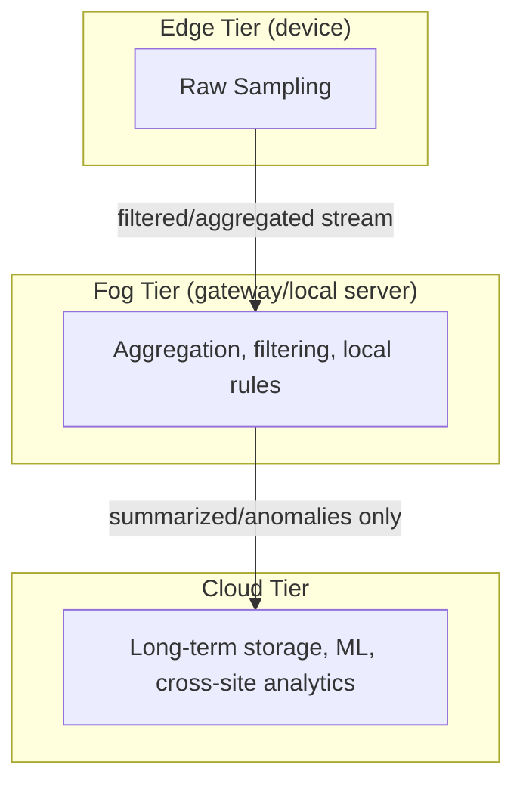

Pushing computation toward the edge reduces the **volume** of data that must be transmitted (saving bandwidth and energy) at the cost of **local compute/power budget**; pushing it to the cloud increases **latency** but permits **cross-device correlation** and heavier models. This trade-off recurs throughout the "IoT Levels" discussion in Section 5.

### 2.6 Mathematical Intuition Behind Data Collection Design

**(a) Sampling rate and the Nyquist–Shannon theorem.**
If a physical signal contains no frequency component higher than $f_{max}$, it can be perfectly reconstructed from samples taken at rate

$$f_s \geq 2 f_{max}$$

Undersampling causes **aliasing** — a high-frequency phenomenon (e.g., a fast pressure transient) is misread as a slower, false one. This determines minimum polling frequency for a sensor node, e.g., an accelerometer monitoring 50 Hz machine vibration must sample at ≥100 Hz.

**(b) Data-rate / bandwidth budgeting.**
For $n$ nodes each producing a payload of $b$ bytes every $T$ seconds, the required uplink throughput is

$$R = \frac{n \cdot b \cdot 8}{T} \text{ bits/second}$$

*Example*: 200 noise-monitoring nodes (Level 4, Section 5.4), each sending a 64-byte JSON packet every 5 s:
$$R = \frac{200 \times 64 \times 8}{5} = 20{,}480 \text{ bits/s} \approx 20.5\text{ kbps}$$
— comfortably within a single LTE-M or Wi-Fi backhaul, illustrating why aggregation/gateway design (Level 5) becomes necessary only as $n$ or sampling frequency grows.

**(c) Duty cycling and energy.**
Average current draw for a node that transmits for duration $t_{tx}$ at current $I_{tx}$ and otherwise sleeps at $I_{sleep}$ over a period $T$:

$$I_{avg} = \frac{I_{tx}\,t_{tx} + I_{sleep}(T - t_{tx})}{T}$$

Battery lifetime estimate: $L = \dfrac{Q_{battery}}{I_{avg}}$ (in hours, if $Q$ is in mAh). This is the quantitative reason edge pre-processing/aggregation (fewer, larger transmissions) extends node lifetime compared to sending every raw reading.

---

## 3. IoT Data Analytics

### 3.1 What Makes IoT Analytics Different From Classical Data Analytics

IoT data is:
- **Streaming** (continuously generated, not a static table),
- **Multivariate & multi-modal** (temperature + humidity + vibration + GPS, etc., often on different clocks),
- **Noisy and lossy** (dropped packets, sensor drift, missing values),
- **Spatio-temporally correlated** (nearby sensors/adjacent timestamps are statistically related),
- Frequently required to yield **actionable output within a bounded latency** (real-time or near-real-time), unlike offline batch BI reporting.

### 3.2 The Four Classes of Analytics (Gartner's Analytics Maturity Model, applied to IoT)

```mermaid
flowchart LR
    D[Descriptive\n"What happened?"] --> Dg[Diagnostic\n"Why did it happen?"]
    Dg --> P[Predictive\n"What will happen?"]
    P --> Pr[Prescriptive\n"What should we do?"]
    style D fill:#cde
    style Dg fill:#bcd
    style P fill:#abc
    style Pr fill:#9ab
```

| Type | IoT Example | Typical Technique |
|---|---|---|
| Descriptive | "Average soil moisture over the last week was 34%" | Aggregation, summary statistics, dashboards |
| Diagnostic | "Moisture dropped because the irrigation valve failed to open at 6 AM" | Root-cause/correlation analysis, rule engines |
| Predictive | "Soil moisture will fall below the wilting threshold in 4 hours" | Regression, time-series forecasting (ARIMA, LSTM) |
| Prescriptive | "Open valve 2 for 12 minutes now to prevent crop stress" | Optimization, reinforcement learning, control theory |

### 3.3 Big-Data Characteristics of IoT Streams — The 5 V's

| V | Meaning in IoT context |
|---|---|
| **Volume** | Millions of nodes × continuous sampling → petabyte-scale archives (e.g., smart grid meters) |
| **Velocity** | Sub-second sensor readings requiring streaming, not batch, processing |
| **Variety** | Structured (numeric telemetry), semi-structured (JSON/XML), unstructured (audio/video from cameras/mics) |
| **Veracity** | Sensor drift, packet loss, calibration error — trustworthiness must be modeled, not assumed |
| **Value** | Raw readings are low-value individually; value is created by aggregation, correlation, and prediction |

### 3.4 Analytics Processing Architectures

**Lambda Architecture** (batch + speed layers, merged at serving layer):

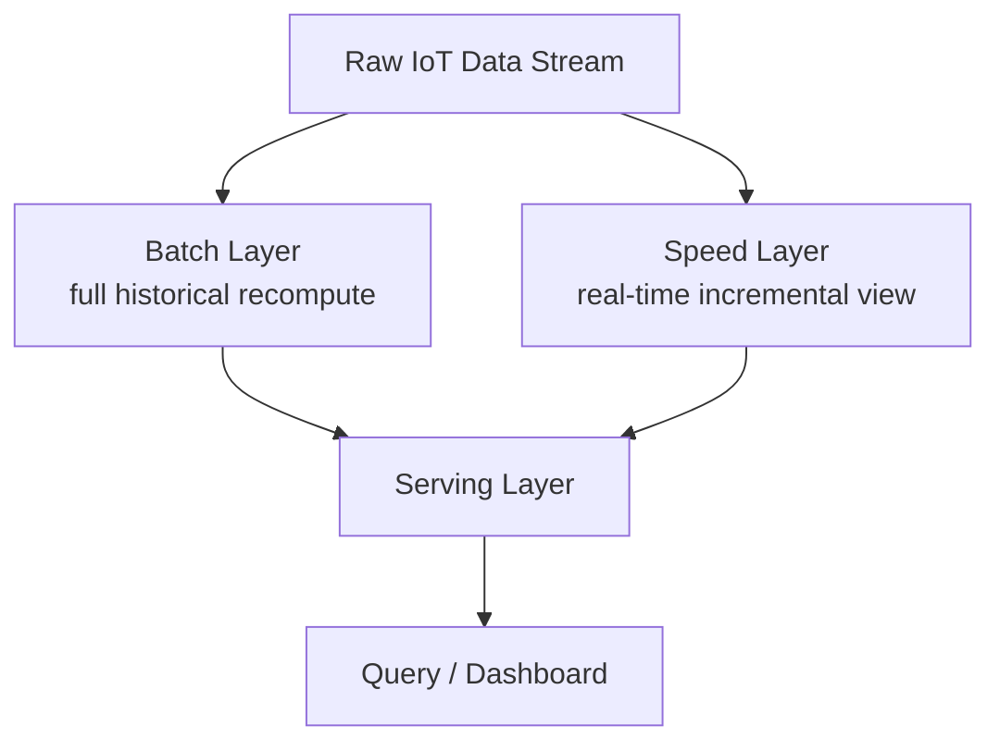

**Kappa Architecture** (stream-only, simpler, replays log for recomputation):

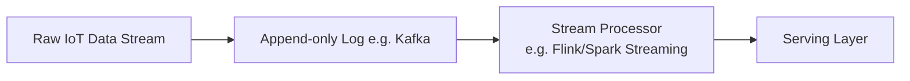

Lambda favors correctness/completeness (via periodic full recomputation); Kappa favors architectural simplicity and lower operational overhead, at the cost of relying entirely on the stream processor's correctness — this is now the more common pattern for real-time IoT dashboards.

### 3.5 Core Statistical and ML Techniques With Mathematical Intuition

**(a) Moving Average smoothing (noise reduction on a stream):**
$$MA_t = \frac{1}{k}\sum_{i=0}^{k-1} x_{t-i}$$
Removes high-frequency sensor jitter; larger $k$ ⇒ smoother but laggier signal (bias–variance trade-off in the time domain).

**(b) Exponential Smoothing (adapts faster, less memory):**
$$S_t = \alpha x_t + (1-\alpha) S_{t-1}, \quad 0<\alpha\le 1$$
Used for lightweight on-device trend tracking since it needs only one stored value $S_{t-1}$ — ideal for memory-constrained microcontrollers.

**(c) Z-score anomaly detection:**
$$z = \frac{x - \mu}{\sigma}$$
A reading is flagged anomalous if $|z| > threshold$ (commonly 3). This is the mathematical basis of most simple IoT "alert" logic (e.g., a temperature spike in forest-fire detection, Section 5.5).

**(d) Simple Linear Regression (predictive analytics, e.g., forecasting a sensor trend):**
Model: $\hat{y} = \beta_0 + \beta_1 x$, fit by minimizing sum of squared errors
$$\min_{\beta_0,\beta_1} \sum_i (y_i - \beta_0 - \beta_1 x_i)^2$$
Closed-form (Ordinary Least Squares) solution:
$$\beta_1 = \frac{\sum (x_i-\bar x)(y_i-\bar y)}{\sum (x_i - \bar x)^2}, \qquad \beta_0 = \bar y - \beta_1 \bar x$$

**(e) K-Means clustering (e.g., grouping sensor nodes by behavior pattern):**
Iteratively minimizes within-cluster variance
$$\arg\min_{S}\sum_{k=1}^{K}\sum_{x\in S_k}\lVert x - \mu_k\rVert^2$$

**(f) Time-series forecasting (ARIMA family):**
An ARIMA(p,d,q) model differences the series $d$ times to achieve stationarity, then models it as
$$\left(1-\sum_{i=1}^{p}\phi_i L^i\right)(1-L)^d X_t = \left(1+\sum_{i=1}^{q}\theta_i L^i\right)\varepsilon_t$$
where $L$ is the lag operator. Used heavily for predictive maintenance and weather-parameter forecasting (Section 5.6).

**(g) Why deep learning appears in IoT analytics:** Recurrent architectures (LSTM/GRU) and 1-D CNNs are preferred over classical ARIMA when relationships are non-linear or multivariate cross-correlations exist (e.g., predicting fire risk jointly from temperature, humidity and wind), because they can learn a non-linear mapping $f_\theta(x_{t-k:t}) \rightarrow \hat x_{t+1}$ directly from data instead of assuming a fixed linear structure.

### 3.6 Edge Analytics vs. Cloud Analytics

| Dimension | Edge Analytics | Cloud Analytics |
|---|---|---|
| Latency | Milliseconds | Hundreds of ms – seconds |
| Model complexity | Lightweight (threshold rules, TinyML) | Heavy (deep learning, cross-node correlation) |
| Data retained | Local/transient | Long-term, queryable history |
| Failure mode | Works during connectivity loss | Depends on network availability |
| Typical use | Immediate safety actuation | Trend discovery, dashboards, retraining models |

### 3.7 Visualization Layer

Dashboards (Grafana, ThingSpeak channels, Power BI, custom React apps) close the loop between analytics and human decision-making, typically rendering time-series charts, geospatial heatmaps (e.g., noise/fire maps), and threshold-based alert banners.

> References: Apache Kafka docs — https://kafka.apache.org/documentation/ ; Grafana docs — https://grafana.com/docs/ ; Marz & Warren, *Big Data: Principles and Best Practices of Scalable Real-time Data Systems* (Lambda Architecture) — https://www.manning.com/books/big-data ; Kreps, "Questioning the Lambda Architecture" (Kappa Architecture) — https://www.oreilly.com/radar/questioning-the-lambda-architecture/

---

## 4. The IoT Data Life Cycle

### 4.1 Definition

The **IoT data life cycle** describes every phase a datum passes through, from its physical origin as a sensor reading to its eventual archival or deletion, together with the transformations and governance controls applied at each stage.

### 4.2 Life-Cycle Flow Diagram

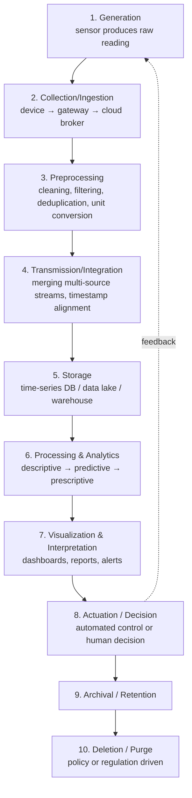

### 4.3 Stage-by-Stage Detail

1. **Generation** — A physical event (temperature change, vibration, GPS fix) is transduced into a digital value at a sampling instant $t_i$. Quality here is bounded by sensor resolution/accuracy and sampling rate (see Nyquist discussion, §2.6a).

2. **Collection/Ingestion** — The value is packetized, timestamped, and transported using a protocol from §2.3. Reliability semantics (QoS) are decided here.

3. **Preprocessing** — Includes:
   - *Cleaning*: removing NaNs, out-of-range values, sensor stuck-at faults.
   - *Filtering*: moving average/Kalman filtering for noise.
   - *Deduplication*: important for QoS-1 MQTT streams which may redeliver.
   - *Unit normalization*: e.g., converting all temperature payloads to Celsius before storage.

4. **Transmission/Integration** — Multiple heterogeneous streams (e.g., a weather station's temperature, humidity, and wind sensors, each on independent clocks) are time-aligned/synchronized, often via interpolation or window-based joins.

5. **Storage** — Persisted to a **time-series database** (InfluxDB, TimescaleDB) for high write-throughput sequential data, or a **data lake** (S3/ADLS + Parquet) for large heterogeneous batches, or a **warehouse** (BigQuery/Redshift) for structured analytical queries. Storage tiering (hot/warm/cold) is typically applied as data ages.

6. **Processing & Analytics** — As detailed in Section 3: from simple aggregation to ML-based prediction.

7. **Visualization & Interpretation** — Human-facing translation of analytic output — this is where "data" becomes "information."

8. **Actuation/Decision** — The system either (a) triggers an automatic actuator (e.g., irrigation valve, alarm siren) or (b) surfaces a recommendation for a human operator. This closes the OODA-style loop (Observe–Orient–Decide–Act) characteristic of control systems.

9. **Archival** — Historical retention for compliance, trend analysis, or model retraining, generally on cheaper "cold" storage.

10. **Deletion/Purge** — Governed by data-retention policy or regulation (e.g., GDPR's storage-limitation principle) — data is expunged once it no longer serves a lawful/operational purpose.

### 4.4 Cross-Cutting Concern: Security & Governance Across the Life Cycle

| Life-cycle stage | Primary risk | Typical control |
|---|---|---|
| Generation/Collection | Spoofed/tampered sensor data | Device identity certificates, TLS/DTLS |
| Preprocessing/Storage | Unauthorized access, data leakage | Encryption at rest, IAM/RBAC |
| Processing/Analytics | Model inversion, re-identification | Differential privacy, aggregation before release |
| Archival/Deletion | Non-compliance with retention law | Automated lifecycle policies (e.g., S3 Lifecycle rules) |

### 4.5 Why the Life-Cycle View Matters

Framing IoT systems by life-cycle stage (rather than only by physical architecture) makes clear that **"IoT data analytics" is not a separate system from "cloud data collection"** — it is stages 5–7 of one continuous pipeline whose earlier stages (1–4) determine the ceiling on how good the later analytics can be ("garbage in, garbage out"). This life-cycle lens is also precisely what differentiates the six IoT Levels discussed next: each level implements a different **subset and placement** of these ten stages.

---

## 5. IoT Levels for Real-Time Application Deployment

### 5.1 Why Classify IoT Systems Into "Levels"?

Not every IoT deployment needs a full cloud pipeline: a single home-automation node with local control logic is architecturally very different from a nationwide network of independent weather stations. The **Level 1–6 taxonomy** (Bahga & Madisetti, 2015) classifies deployments by three orthogonal design questions:

1. **How many physical nodes** are involved (single node vs. multiple)?
2. **Where is data stored/analyzed** — locally on the node, or in the cloud?
3. **Is there a local coordinator/aggregator** between the nodes and the cloud, or does every node talk to the cloud directly?

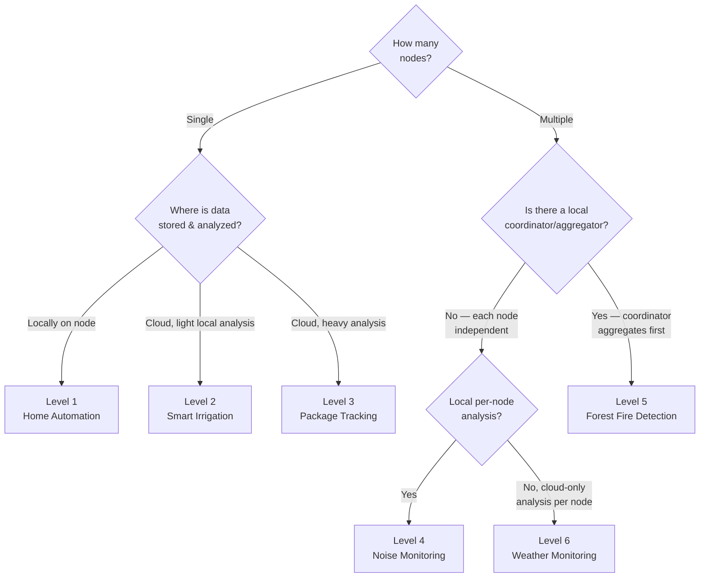

### 5.2 Level 1 — Home Automation (Single Node, Single "Thing", Local Everything)

**Definition.** All required functions — sensing/actuation, control logic, application/UI — reside **within a single physical node** (or a tightly bound node + local hub). Data may optionally be logged locally; there is no mandatory cloud dependency for the system to function.

**When to use:** Low cost, low latency, simple logic (`if X then Y`), no need for historical big-data analysis, and acceptable for the application to fail-safe locally if internet connectivity drops.

**Architecture:**

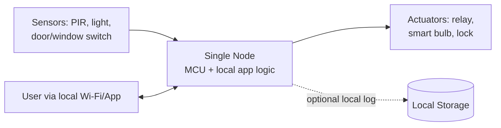

**Worked example.** A home-automation node reads a light-dependent resistor (LDR) and a PIR motion sensor; local firmware implements the rule:
$$\text{turn\_on\_light} = (\text{motion\_detected}) \wedge (\text{illuminance} < \tau_{lux})$$
The threshold $\tau_{lux}$ is tuned locally; no cloud round-trip is required, so latency is bounded only by the microcontroller's loop time (typically < 100 ms).

**Key characteristics:** single node · local storage/analysis · minimal network dependency · lowest cost and complexity · limited scalability and no cross-home analytics.

### 5.3 Level 2 — Smart Irrigation (Single Node, Local Analysis + Cloud Storage)

**Definition.** Still a **single node**, but it now offloads **data storage to the cloud**; local analysis is retained because the required computation (a threshold/rule) is not intensive, while historical logging benefits from centralized, durable, queryable cloud storage.

**Architecture:**

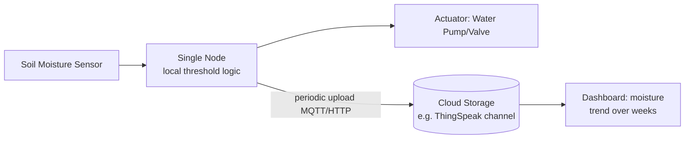

**Worked example.** A capacitive soil-moisture probe reports a percentage value $m(t)$ every 15 minutes. The node applies a **local** rule
$$\text{pump\_on} = m(t) < m_{threshold}$$
while simultaneously pushing $m(t)$ to a cloud channel (e.g., ThingSpeak/AWS IoT) purely for historical visualization and, later, seasonal trend analysis (e.g., regression from §3.5d to correlate rainfall with moisture decay rate). Note this matches published smart-irrigation prototypes using ESP32 + soil sensors uploading to ThingSpeak for remote monitoring and historical analytics<cite index="14-1">Bangladeshi researchers built such a plant monitoring and irrigation system where an ESP32 microcontroller collects soil moisture and other sensor data and wirelessly transmits it to the ThingSpeak cloud platform for remote monitoring, historical analysis, and automated alerts</cite>.

**Why Level 2, not Level 1:** the decision logic is still local (fast, offline-safe), but because agronomic decisions benefit from **big historical datasets** (season-over-season trends), storage — not computation — is moved to the cloud.

### 5.4 Level 3 — Package Tracking (Single Node, Cloud Storage *and* Cloud Analysis)

**Definition.** Again a **single node** (attached to one package/shipment), but now **both storage and analysis** are performed in the cloud, because the computation required (route optimization, ETA prediction, anomaly/tamper detection across a fleet) is too intensive and too data-hungry for the node itself.

**Architecture:**

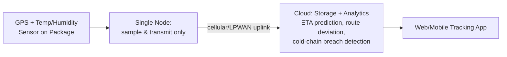

**Worked example.** A cold-chain shipment node reports GPS coordinates and temperature every 2 minutes. The cloud application:
- Computes ETA using historical route-time distributions (predictive analytics),
- Flags a **cold-chain breach** if temperature exceeds a threshold for more than $k$ consecutive readings (a stateful anomaly rule, generalizing the z-score idea of §3.5c to a persistence condition),
- Aggregates thousands of concurrent shipments for fleet-wide dashboards — a task impossible on a single constrained node.

**Why Level 3, not Level 2:** the *node* is architecturally identical in cardinality (still one node per "thing"), but this time analysis itself, not just storage, has moved to the cloud because it requires cross-shipment historical models and heavier computation than a microcontroller can provide.

### 5.5 Level 4 — Noise Monitoring (Multiple Nodes, Each With Local Analysis, Independent Cloud Storage)

**Definition.** **Multiple nodes** are deployed (e.g., across a city), each capable of local analysis (e.g., computing an instantaneous decibel reading and short-term average), and **each node independently stores its data to the cloud** — there is no local coordinator aggregating the nodes before the cloud.

**Architecture:**

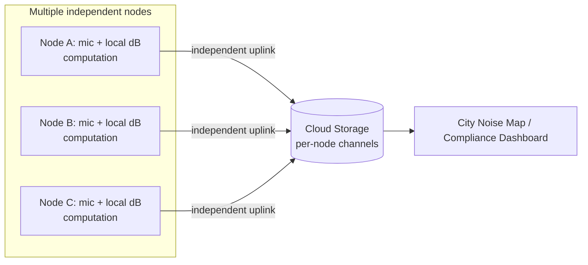

**Worked example.** Each node samples audio, computes an equivalent continuous sound level over a one-minute window,
$$L_{eq} = 10\log_{10}\left(\frac{1}{N}\sum_{i=1}^{N} 10^{L_i/10}\right) \text{ dB}$$
(the standard acoustics formula for energy-averaged decibel level), then uploads $L_{eq}$ independently to the cloud. This mirrors real deployments such as India's CPCB National Ambient Noise Monitoring Network, where fixed monitors at multiple city locations independently report readings, and mobile-node research systems extend this with additional per-node local processing<cite index="12-1">continuous and accurate noise monitoring is essential, and traditionally noise levels are measured using stationary sound meters deployed at multiple locations across major cities to enable policymakers to design mitigation strategies, though such fixed systems often lack real-time adaptability and spatial coverage</cite>.

**Why Level 4, not Level 3:** cardinality changes — many nodes, not one — but there is still **no in-network aggregator**; every node is its own independent Level-3-like "single node system" from the cloud's point of view, just multiplied.

### 5.6 Level 5 — Forest Fire Detection (Multiple Nodes + Local Coordinator/Aggregator, Then Cloud)

**Definition.** **Multiple sensor nodes** (temperature, humidity, smoke/CO, sometimes camera) are deployed over a wide geographic area (a **Wireless Sensor Network**), but instead of every node independently contacting the cloud, they first report to a **local coordinator/gateway node**, which aggregates, and typically performs initial fusion/filtering, before forwarding to the cloud for storage and heavier analysis.

**Architecture:**

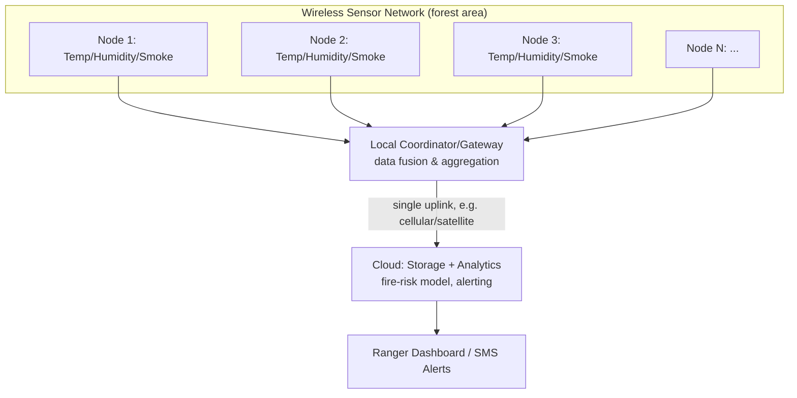

**Worked example.** Each leaf node reports temperature $T_i$, humidity $H_i$, and smoke concentration $C_i$ to the coordinator every 30 s. The coordinator computes a simple **fire risk index** by fusing multiple nodes' readings, e.g.
$$FRI = w_1 \cdot \frac{T - T_{min}}{T_{max}-T_{min}} + w_2\left(1-\frac{H-H_{min}}{H_{max}-H_{min}}\right) + w_3\cdot \frac{C}{C_{max}}$$
(a weighted, normalized composite index — the same "feature-fusion" idea used in most rule-based environmental risk scores), and forwards the composite plus raw readings to the cloud only if $FRI$ crosses a threshold or on a regular heartbeat — reducing uplink cost versus Level 4's independent-node approach. This matches contemporary architectures that use a **central gateway** with real-time sensor fusion (smoke, temperature, humidity) from distributed nodes to drive detection and reduce false positives<cite index="16-1">a low-cost forest fire detection system can use a central gateway device to monitor a wide field of view for smoke while a detection agent leverages real-time sensor data — smoke levels, ambient temperature, and humidity — from distributed IoT devices, enabling automated wildfire monitoring across expansive areas while reducing false positives</cite>.

**Why Level 5, not Level 4:** the defining new element is the **coordinator/aggregator tier** between many nodes and the cloud — this is the Wireless-Sensor-Network pattern, suitable when node density is high, bandwidth to the cloud is precious (remote forest = poor connectivity), and in-network fusion improves both energy efficiency and detection accuracy.

### 5.7 Level 6 — Weather Monitoring System (Multiple Independent Nodes, Cloud-Only Aggregation & Analysis)

**Definition.** **Multiple, geographically independent nodes** (weather stations), each with its own full sensor suite, connect **directly and independently to the cloud** (no local coordinator, unlike Level 5) because the nodes are not co-located in one sensor network but scattered across a wide region (a city, state, or country), and the value of the system comes precisely from **cloud-side cross-station analysis**.

**Architecture:**

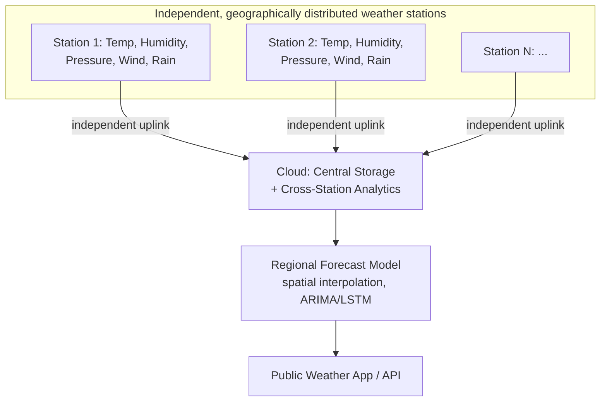

**Worked example.** Each of $N$ independent stations reports a vector $x_i(t) = [T_i, H_i, P_i, v_i, r_i]$ every 10 minutes directly to the cloud. Cloud-side analytics then:
- Applies **spatial interpolation** (e.g., inverse-distance weighting or Kriging) across stations to estimate conditions at unmonitored locations,
- Runs **time-series forecasting** (ARIMA/LSTM, §3.5f–g) per station and blends with interpolated neighbors for short-term nowcasting,
- Publishes results through a public API/dashboard.

**Why Level 6, not Level 5:** although both involve *many nodes*, Level 5's nodes are physically clustered and pre-aggregated locally because they jointly observe *one* phenomenon (a single forest's fire risk) over a small area; Level 6's stations are deliberately *spread across a wide, disconnected geography* observing *many local instances* of the same phenomenon (regional weather) — aggregation is therefore meaningful only in the cloud, where cross-station spatial models can be built, and no local coordinator would make sense since the stations aren't physically near each other.

---

## 6. Comparative Summary of All Six Levels

| Level | # Nodes | Local Analysis? | Local Coordinator? | Storage | Analysis Location | Example | Best Suited When |
|---|---|---|---|---|---|---|---|
| **1** | Single | Yes | N/A | Local (optional) | Local | Home Automation | Simple rules, offline tolerance required, lowest cost |
| **2** | Single | Yes (lightweight) | N/A | Cloud | Local | Smart Irrigation | Simple control logic but valuable historical/seasonal data |
| **3** | Single | No | N/A | Cloud | Cloud | Package Tracking | Computation-heavy analysis (ETA, fleet-wide correlation) needed per single "thing" |
| **4** | Multiple | Yes (per node) | No | Cloud (independent per node) | Local + Cloud | Noise Monitoring | Many independent monitoring points, no need to fuse before upload |
| **5** | Multiple | Partial (at coordinator) | **Yes** | Cloud (via aggregator) | Coordinator + Cloud | Forest Fire Detection | Dense sensor network, need in-network fusion, constrained backhaul |
| **6** | Multiple | No (per node) | No | Cloud (independent per node) | Cloud (cross-node) | Weather Monitoring | Geographically dispersed nodes; value comes from centralized cross-site modeling |

**Underlying design gradient:** Levels 1→3 trace how a *single* node's responsibility for storage/analysis progressively migrates to the cloud as computational/data demands grow. Levels 4→6 repeat that same gradient for *multiple-node* systems, additionally asking whether nodes should be pre-aggregated by a local coordinator (Level 5) versus reporting independently and being fused only in the cloud (Levels 4 and 6, which differ in whether per-node local analysis is retained).

---

## 7. References

1. Bahga, A., & Madisetti, V. (2015). *Internet of Things: A Hands-On Approach.* Universities Press. (Primary source of the IoT Level 1–6 classification.)
2. NPTEL, *Introduction to Internet of Things* course (based on the above text) — https://nptel.ac.in/
3. MQTT Specification — https://mqtt.org/
4. CoAP — RFC 7252, "The Constrained Application Protocol" — https://www.rfc-editor.org/rfc/rfc7252
5. AWS IoT Core Developer Guide — https://docs.aws.amazon.com/iot/
6. Microsoft Azure IoT Hub Documentation — https://learn.microsoft.com/azure/iot-hub/
7. ThingSpeak (MathWorks) — https://thingspeak.mathworks.com/
8. Google Cloud, *IoT Core Retirement Notice* — https://cloud.google.com/iot/docs/release-notes (service discontinued August 16, 2023)
9. Marz, N., & Warren, J. *Big Data: Principles and Best Practices of Scalable Real-Time Data Systems* (Lambda Architecture) — https://www.manning.com/books/big-data
10. Kreps, J. "Questioning the Lambda Architecture," O'Reilly Radar — https://www.oreilly.com/radar/questioning-the-lambda-architecture/
11. Apache Kafka Documentation — https://kafka.apache.org/documentation/
12. Grafana Documentation — https://grafana.com/docs/
13. Box, G., Jenkins, G., Reinsel, G. *Time Series Analysis: Forecasting and Control* (ARIMA models).
14. Salcedo, E. et al., "ForestProtector: An IoT Architecture Integrating Machine Vision and Deep Reinforcement Learning for Efficient Wildfire Monitoring," arXiv:2501.09926 — https://arxiv.org/pdf/2501.09926
15. Hasib, A., & Akib, A. S. M. A. S., "An IoT-Based Smart Plant Monitoring and Irrigation System with Real-Time Environmental Sensing, Automated Alerts, and Cloud Analytics," arXiv:2601.15830 — https://arxiv.org/abs/2601.15830
16. IoT-based Noise Monitoring using Mobile Nodes for Smart Cities, arXiv:2509.00979 — https://arxiv.org/pdf/2509.00979

---

*End of notes. Diagrams are provided in Mermaid syntax — paste any code block into a Mermaid-compatible viewer (e.g., the Mermaid Live Editor at https://mermaid.live, Obsidian, or VS Code with the Mermaid extension) if your viewer does not auto-render them.*
